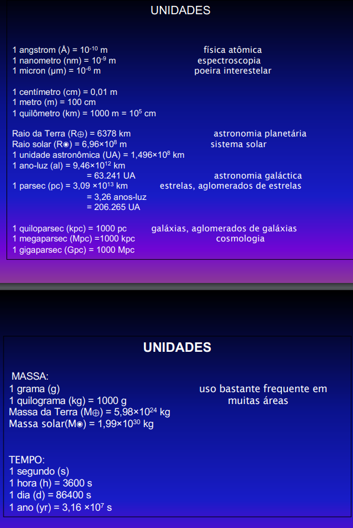
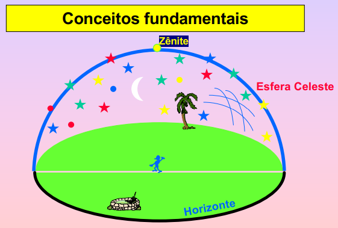
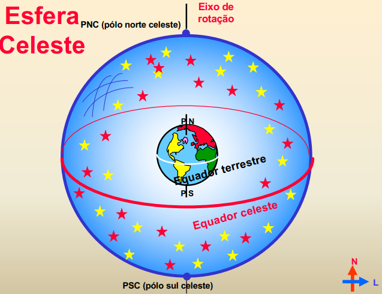
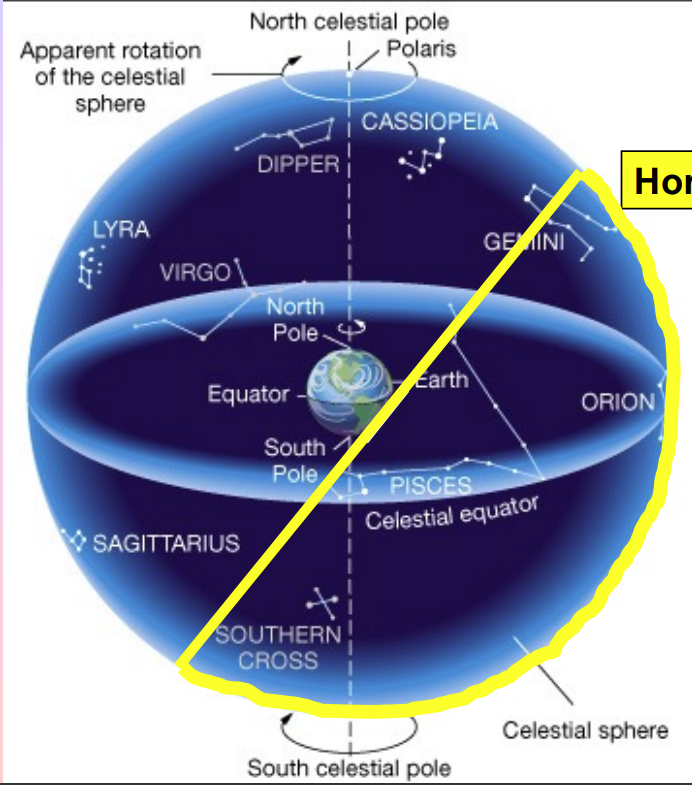
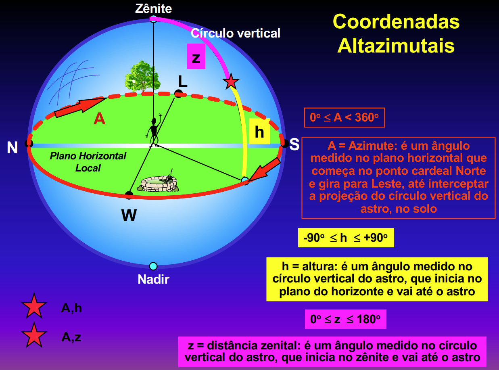
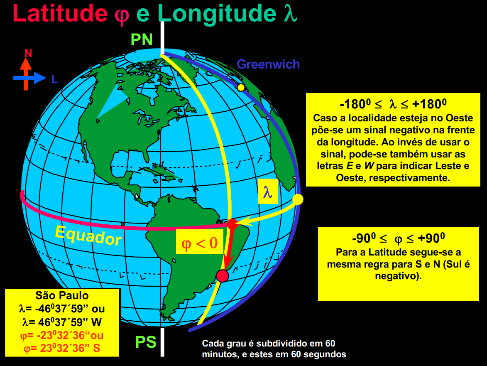
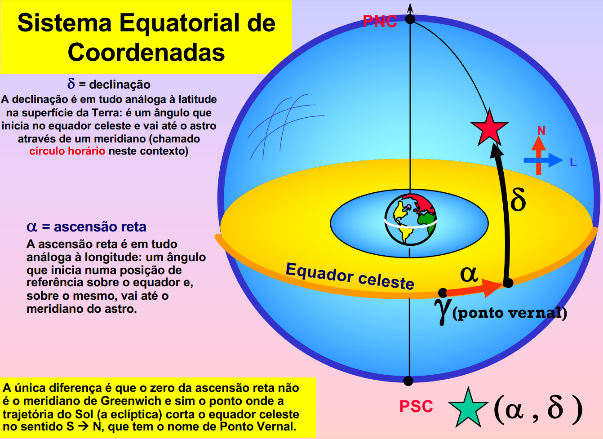
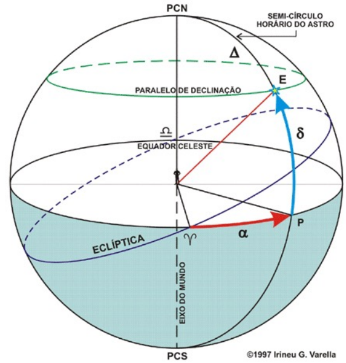
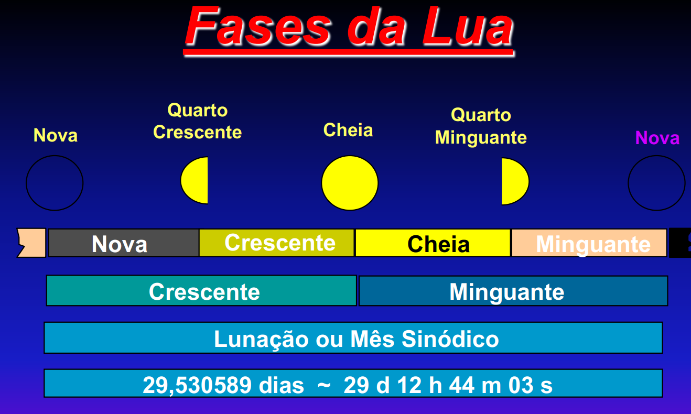

# AGA0215 - Fundamentos da Astronomia

## Aula 01 - Escalas de distância e dimensões

- Existem cerca de $10^{23}$ bilhões de estrelas no universo observável.
- Terra é um planeta rochoso.
- A Terra tem cerca de 12.800 km de diâmetro.
- O diâmetro do Sol é cerca de 110 vezes o diâmetro da Terra.
- 1 UA (Unidade Astronômica) é a distância média entre a Terra e o Sol.
  - 1 UA = 149.600.000 km.
- 1 ano-luz é a distância que a luz percorre em 1 ano.
  - 1 ano-luz = 9.5 trilhões de km = $9.5 \cdot 10^{12}\text{km}$.
- 1 parsec é a distância sol-estrela se a paralaxe medida for de $1''$.
  - 1 parsec = $3.09\cdot 10^{13}$ km = $2.06\cdot 10^5$ UA = 3.26 anos-luz.
- Paralaxe
  - Medida em graus, minutos e segundos de arco.
  - Paralaxe geométrica
    - Distâncias até 1 hora-luz ($10^9$ km).
- $D(pc) = \dfrac{1}{paralaxe('')}$.
- Estrelas
  - Anã
    - Ex.: Sol
    - Raio de 700.000 km
  - Gigante
    - Ex.: Pollux
    - Raio de 7.000.000 km (10 vezes o raio do Sol)
  - Supergigante
    - Ex.: Sol
    - Raio de 441.000.000 km (630 vezes o raio do Sol)
- Via Láctea
- 

## Aula 02 - Obseração do céu I (orientação no céu noturno)

- Conceitos fundamentais
  - 
  - Zênite
  - Esfera celeste
  - Horizonte
- Constelações
  - O que são?
    - São agrupamentos aparentes de estrelas angularmente próximas.
    - Estrelas de uma mesma constelação podem estar muito longe uma das outras e de nós, porém angularmente próximas.
  - Quantas são?
    - São 88 constelações, de acordo com a IAU (International Astronomical Union).
    - Número arbitrário, e muda com o tempo.
  - Sempre foram as mesmas?
    - Não. Cada povo e cultura diferentes definiu um conjunto de constelações com nomes diferentes e em números diferentes.
  - Quantas estrelas tem em cada constelação?
    - A questão não faz sentido!
      - As constelações apenas delimitam regiões na esfera celeste, e podem conter qualquer número de estrelas.
- Esfera celeste
  - 
  - A estrela **Polaris** é referência do polo norte, pois está quase sobre o eixo de rotação da Terra.
    - Não existe uma estrela brilhante análoga no polo sul.
  - O movimento aparente das estrelas é de leste para oeste.
    - O movimento é devido à rotação da Terra.
  - As constelações visíveis durante a noite variam ao longo do ano.
    - Pois a Terra orbita o Sol.
  - 
- A localização de estrelas no céu normalmente é dada em termos de posições e separações angulares.
  - O tamanho angular de um objeto depende do seu tamanho verdadeiro e da sua distância.
- Pontos cardeais
  - Nascer do Sol
    - O Sol não nasce sempre no mesmo ponto na direção Leste.
    - O ponto cardeal leste não é definido pela posição em que o Sol nasce.
    - O Sol nasce em diferentes pontos do horizonte dependendo da época do ano.
  - Para definir os pontos cardeais em um certo ponto da Terra, trace uma reta perpendicular à reta do meridiano, no ponto onde foi colocada a estaca que projeta uma sombra. Essa reta indicará os pontos cardeais.
  - Uma **estrela circumpolar** é uma estrela que nunca desce abaixo da linha do horizonte.
- Sistemas de coordenadas celestes
  - Utilidade:
    - Localizar univocamente um objeto no céu.
    - Registrar a localização de um objeto desconhecido.
  - Sistema altazimutal
    - 
    - Desvantagens:
      - As coordenadas dependem da localização do observador na Terra e do horário da observação.
  - Sistema equatorial
    - 
    - 
      - [[ponto vernal]]
      - [[eclíptica]]
      - 
      - Vantagens:
        - As coordenadas são fixas, não dependendo da localização do observador na Terra, nem o horário da observação.
- Movimentos da Terra
  - A Terra tem ângulo de inclinação de 23,5 graus em relação ao plano da órbita.

## Aula 03 - Observação do céu II

- O dia
  - [[dia solar médio]]
  - [[dia sideral]]
  - A Terra não orbita o Sol com velocidade constante.
    - Ela é mais rápida em janeiro, quanto está mais perto do Sol e mais lenta em julho, quando está mais longe do Sol.
    - [[segunda lei de Kepler]]
- O ano
  - [[ano sideral]]
  - [[ano trópico]]
  - Há uma diferença entre 20,41 minutos entre o [[ano sideral]] e o [[ano trópico]].
  - Nosso calendário usa o [[ano trópico]], pois uma das principais utilidades do calendário é marcar as estações do ano.
    - Se usássemos o [[ano sideral]], as estações do ano mudariam de data a cada ano.
- Movimento dos planos fundamentais
  - [[precessão]]
  - [[nutação]]

## Aula 04 - Sol, Terra e Lua

- Fases da Lua
  - 
  - O período compreendido entre dois inícios consecutivos duma mesma fase da Lua é denominado de **lunação** (ou **mês sinódico**).
    - Dura aproximadamente 29.530589 dias.
    - Isso permitiu que os dias fossem agrupados em blocos de 29 ou 30, com o nome de **mês lunar**.
  - [[período sinódico da Lua]]
  - [[período sideral da Lua]]
  - A razão da diferença entre eles é análoga à razão da diferença entre o [[dia solar médio]] e o [[dia sideral]].
    - Enquanto a Lua gira em torno da Terra, o Sistema Terra-Lua gira em torno do Sol, de modo que é necessário um tempo adicional para que as condições de observação (o ciclo das fases) se repita.
    - 