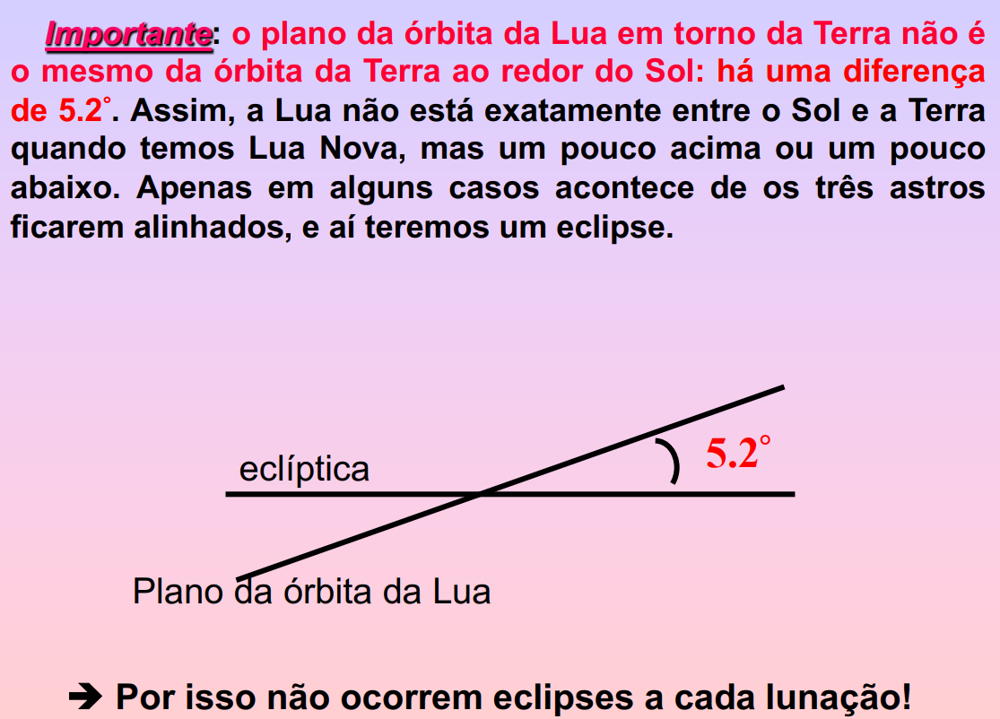
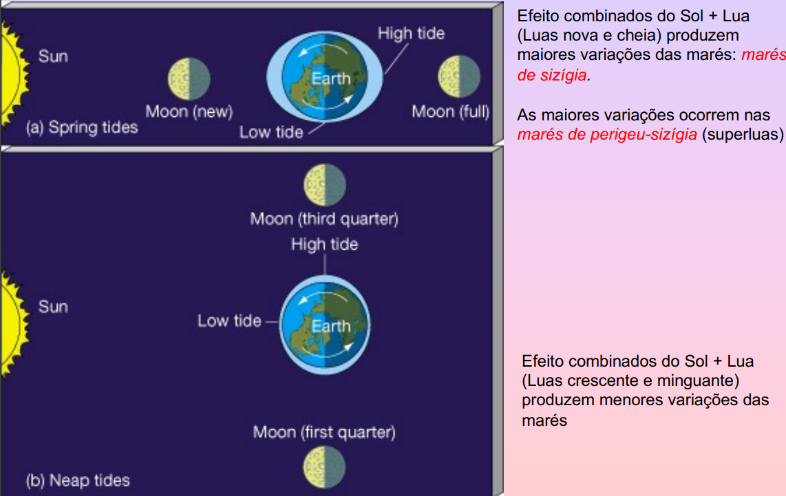
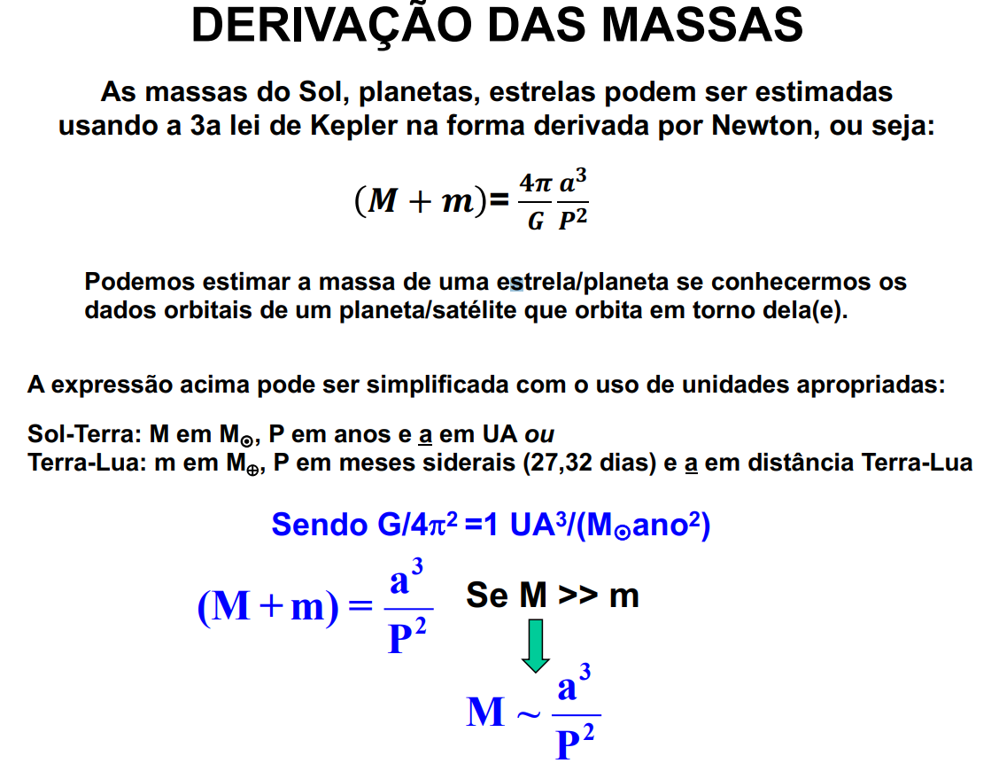
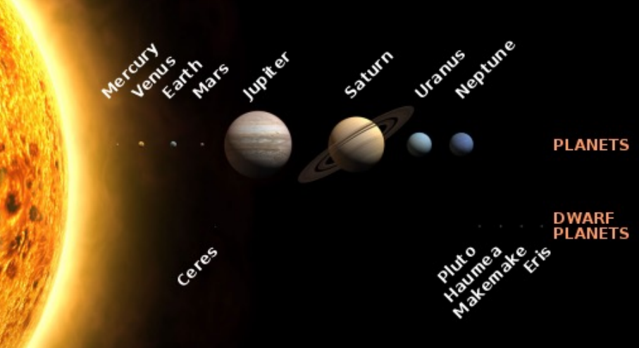
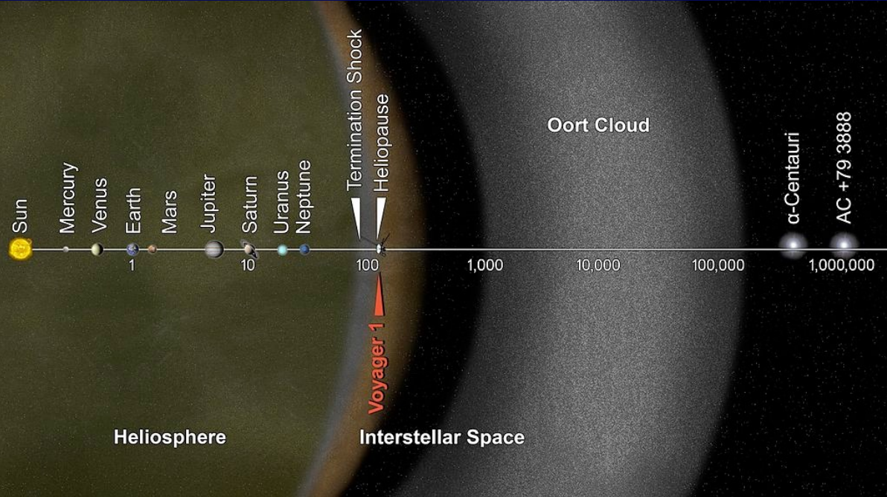
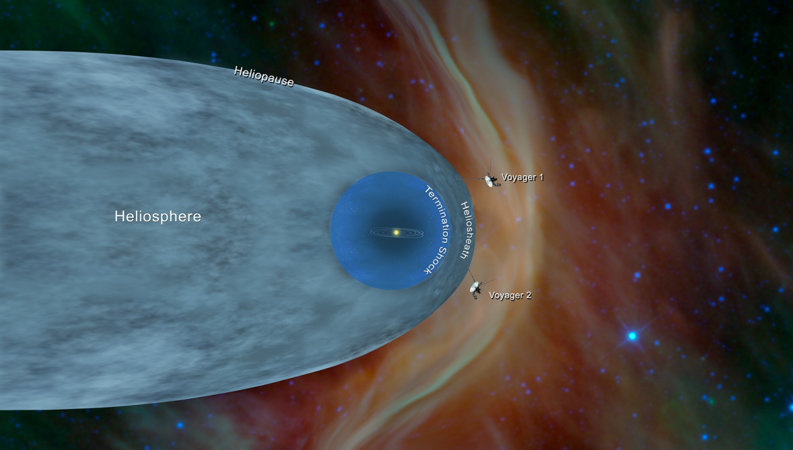
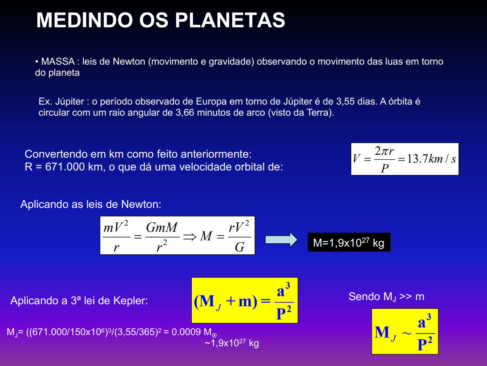

# AGA0215 - Fundamentos da Astronomia

## Aula 01 - Escalas de distância e dimensões

- Existem cerca de $10^{23}$ bilhões de estrelas no universo observável.
- Terra é um planeta rochoso.
- A Terra tem cerca de 12.800 km de diâmetro.
- O diâmetro do Sol é cerca de 110 vezes o diâmetro da Terra.
- 1 UA (Unidade Astronômica) é a distância média entre a Terra e o Sol.
  - 1 UA = 149.600.000 km.
- 1 ano-luz é a distância que a luz percorre em 1 ano.
  - 1 ano-luz = 9.5 trilhões de km = $9.5 \cdot 10^{12}\text{km}$.
- 1 parsec é a distância sol-estrela se a paralaxe medida for de $1''$.
  - 1 parsec = $3.09\cdot 10^{13}$ km = $2.06\cdot 10^5$ UA = 3.26 anos-luz.
- [[paralaxe]]
- Estrelas
  - Anã
    - Ex.: Sol
    - Raio de 700.000 km
  - Gigante
    - Ex.: Pollux
    - Raio de 7.000.000 km (10 vezes o raio do Sol)
  - Supergigante
    - Ex.: Sol
    - Raio de 441.000.000 km (630 vezes o raio do Sol)
- Via Láctea
- 

## Aula 02 - Obseração do céu I (orientação no céu noturno)

- Conceitos fundamentais
  - 
  - Zênite
  - Esfera celeste
  - Horizonte
- Constelações
  - O que são?
    - São agrupamentos aparentes de estrelas angularmente próximas.
    - Estrelas de uma mesma constelação podem estar muito longe uma das outras e de nós, porém angularmente próximas.
  - Quantas são?
    - São 88 constelações, de acordo com a IAU (International Astronomical Union).
    - Número arbitrário, e muda com o tempo.
  - Sempre foram as mesmas?
    - Não. Cada povo e cultura diferentes definiu um conjunto de constelações com nomes diferentes e em números diferentes.
  - Quantas estrelas tem em cada constelação?
    - A questão não faz sentido!
      - As constelações apenas delimitam regiões na esfera celeste, e podem conter qualquer número de estrelas.
- Esfera celeste
  - 
  - A estrela **Polaris** é referência do polo norte, pois está quase sobre o eixo de rotação da Terra.
    - Não existe uma estrela brilhante análoga no polo sul.
  - O movimento aparente das estrelas é de leste para oeste.
    - O movimento é devido à rotação da Terra.
  - As constelações visíveis durante a noite variam ao longo do ano.
    - Pois a Terra orbita o Sol.
  - 
- A localização de estrelas no céu normalmente é dada em termos de posições e separações angulares.
  - O tamanho angular de um objeto depende do seu tamanho verdadeiro e da sua distância.
- Pontos cardeais
  - Nascer do Sol
    - O Sol não nasce sempre no mesmo ponto na direção Leste.
    - O ponto cardeal leste não é definido pela posição em que o Sol nasce.
    - O Sol nasce em diferentes pontos do horizonte dependendo da época do ano.
  - Para definir os pontos cardeais em um certo ponto da Terra, trace uma reta perpendicular à reta do meridiano, no ponto onde foi colocada a estaca que projeta uma sombra. Essa reta indicará os pontos cardeais.
  - [[estrela circumpolar]]
- Sistemas de coordenadas celestes
  - Utilidade:
    - Localizar univocamente um objeto no céu.
    - Registrar a localização de um objeto desconhecido.
  - Sistema altazimutal
    - 
    - Desvantagens:
      - As coordenadas dependem da localização do observador na Terra e do horário da observação.
  - Sistema equatorial
    - 
    - 
      - [[ponto vernal]]
      - [[eclíptica]]
      - 
      - Vantagens:
        - As coordenadas são fixas, não dependendo da localização do observador na Terra, nem o horário da observação.
- Movimentos da Terra
  - A Terra tem ângulo de inclinação de 23,5 graus em relação ao plano da órbita.

## Aula 03 - Observação do céu II

### O dia

- [[dia solar médio]]
- [[dia sideral]]
- A Terra não orbita o Sol com velocidade constante.
  - Ela é mais rápida em janeiro, quanto está mais perto do Sol e mais lenta em julho, quando está mais longe do Sol.
  - [[segunda lei de Kepler]]

### O ano

- [[ano sideral]]
- [[ano trópico]]
- Há uma diferença entre 20,41 minutos entre o [[ano sideral]] e o [[ano trópico]].
- Nosso calendário usa o [[ano trópico]], pois uma das principais utilidades do calendário é marcar as estações do ano.
  - Se usássemos o [[ano sideral]], as estações do ano mudariam de data a cada ano.

### Movimento dos planos fundamentais

- [[precessão]]
- [[nutação]]

## Aula 04 - Sol, Terra e Lua

### Fases da Lua

- 
- O período compreendido entre dois inícios consecutivos duma mesma fase da Lua é denominado de **lunação** (ou **mês sinódico**).
  - Dura aproximadamente 29.530589 dias.
  - Isso permitiu que os dias fossem agrupados em blocos de 29 ou 30, com o nome de **mês lunar**.
- [[período sinódico da Lua]]
- [[período sideral da Lua]]
- A razão da diferença entre eles é análoga à razão da diferença entre o [[dia solar médio]] e o [[dia sideral]].
  - Enquanto a Lua gira em torno da Terra, o Sistema Terra-Lua gira em torno do Sol, de modo que é necessário um tempo adicional para que as condições de observação (o ciclo das fases) se repita.
  - As fases da Lua ocorrem devido à posição relativa do Sol, da Terra e da Lua, e não pela fração intrinsecamente iluminada da Lua ser maior ou menor.
- Eclipses
  - Por que não ocorrem eclipses a cada lunação?
    - ANOTE: O plano orbital da Lua em torno da Terra é inclinado a 5,2 graus em relação ao plano eclíptico, por isso não ocorrem eclipses a cada lunação!
    - 
    - 
  - [[eclipse lunar]]
  - [[eclipse solar]]

### Forças da maré

- O que causa as marés?
  - A força gravitacional diferencial exercida pela Lua e Sol sobre pontos diferentes na Terra.
  - Para o Sol, o efeito é menor.
- Sequêcia da maré
  - 
- Efeitos da maré
  - [[rotação síncrona da lua]]

## Aula 05 - Sistema solar - Movimentos e órbitas planetárias

- Sistema geocêntrico
  - Tudo gira em torno da Terra.
  - epiciclo
- Sistema híbrido
  - Mercúrio e Vênus giram em torno do Sol.
  - O Sol gira em torno da Terra.
- Sistema heliocêntrico
  - Nicolau Copérnico
  - Movimentos retrógrados são facilmente explicados.

### Leis de Kepler

- [[primeira lei de Kepler]]
- [[segunda lei de Kepler]]
- [[terceira lei de Kepler]]

### Propriedades das órbitas planetárias

- [[periélio]] e [[afélio]]

### Leis de Newton

- primeira lei de Newton
- segunda lei de Newton
- terceira lei de Newton
- [[lei da gravitação universal]]
- derivação das massas
  - 
- velocidade de escape

## Aula 06 - Sistema Solar - Uma visão geral

- O sistema solar consiste em:
  - Sol
  - Oito planetas clássicos
  - Planetas anões (6 ocnfirmados, e muitos a confirmar)
  - Mais de 250 satélites pertencentes aos planetas
  - Um grande número de pequenos corpos (cometas, asteroides ou planetoides)
  - Meio interplanetário
  - 
- Sistema solar interno
  - Sol
  - Planetas terrestres (ou **telúricos**)
    - Mercúrio, Vênus, Terra e Marte
- Sistema solar externo
  - Planetas Jovianos
    - Júpiter, Saturno, Urano e Netuno
  - Planeta anão
    - Plutão
  - Cinturão de Kuiper (planetóides congelados)
- Extensão do sistema solar
  - 50000 a 100000 UA, além do cinturão de Kuiper
  - 
- O sistema solar e o meio interestelar
  - O sistema solar está todo imerso em uma bolha de partículas ejetadas pelo Sol, o **vento solar**.
    - Essa bolha termina quando as partículas desaceleram pela pressão exercida pelo meio interestelar.
  -
- Os planetas giram ao redor do Sol no sentido anti-horário (com o polo norte solar visto de cima)
- [[alinhamento planetário]]

### Medindo os planetas

- 
  
### Classificação dos 8 planetas do sistema solar

- Por composição química
  - Planetas terrestres/rochosos/telúricos
    - Mercúrio, Vênus, Terra e Marte
    - Compostos por rochas e metais
    - Altas densidades relativas
    - Rotação mais lenta
    - Superfície sólida
    - Sem anéis
    - Poucas luas
  - Planetas jovianos/gasosos
    - Júpiter, Saturno, Urano e Netuno
    - Composos por hidrogênio e hélio
    - Baixa densidades
    - Rotação rápida
    - Camada atmosférica espessa
    - Anéis
    - Muitos satélites
- Por tamanho
  - Planetas pequenos
    - Mercúrio, Vênus, Terra e Marte
    - Diâmetro menor que 13000 km
  - Planetas grandes
    - Júpiter, Saturno, Urano e Netuno
    - Diâmetro maior que 48000 km
- Pela posição relativa ao Sol
  - O cinturão principal de asteróides situado entre Marte e Júpiter marca os limites do sistema solar interno e externo
  - Planetas internos
    - Mercúrio, Vênus, Terra e Marte
  - Planetas externos
    - Júpiter, Saturno, Urano e Netuno
- Pela posição relativa à Terra
  - Planetas inferiores
    - Mercúrio e Vênus
  - Planetas superiores
    - Marte, Júpiter, Saturno, Urano e Netuno

- [[planeta anão]]
  - Ceres, Plutão, Eris
- Exoplanetas (ou planetas extrassolares)
  - Planetas fora do domínio do Sol
- Asteroides
- Cometas

## Aula 07 - Planetas internos

### Terra

- Por que o céu é azul visto da Terra?
  - A atmosfera dispersa a luz azul mais do que a luz vermelha.
    - Espalhamento rayleigh: o comprimento de onda da luz azul é aproximadamente do mesmo tamanho do que as moléculas de gás do ar, portanto a luz azul é espalhada mais eficientemente.
- Efeito estufa

### Lua

- Origem da Lua
  - Modelo do impacto Gigante
    - Um objeto de tamanho aproximadamente de Marte colidiu com a Terra em formação (ainda não totalmente sólida).
  
### Mercúrio

- Não possui quase nenhuma atmosfera
- Nâo possui atividade geológica
- Não possui satélites
- Extremamente quente durante o dia
- É possível haver água em Mercúrio?
  - 

### 