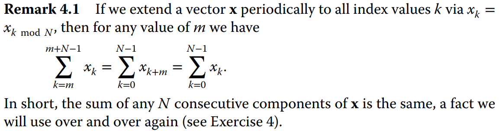
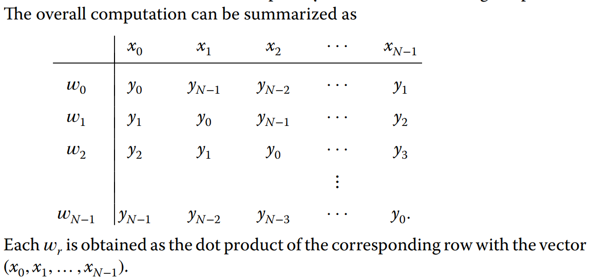

# Convolution and Filtering

Convolução é um método no domínio tempmoral para filtragem de sinais.

## 4.2 - One-Dimensional Convolution

- low-pass filtering
  - é um tipo especial de convolução
  - moving average
- assumir que os sinais são periódicos: $x_k = x_{k \mod N}$
- 

### Definição de convolução:

$$w_r = \sum_{k=0}^{N-1} x_k y_{r-k \mod N}$$
para $r = 0, 1, \dots, N-1$. A convolução de $x$ e $y$ é denotada por $w = x \ast y$.

### Propriedades da convolução:

- linearidade
- comutatividade
- matriz circulante
- associatividade
- periodicidade
