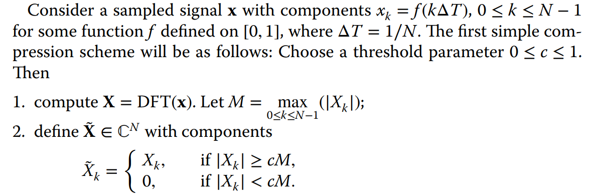
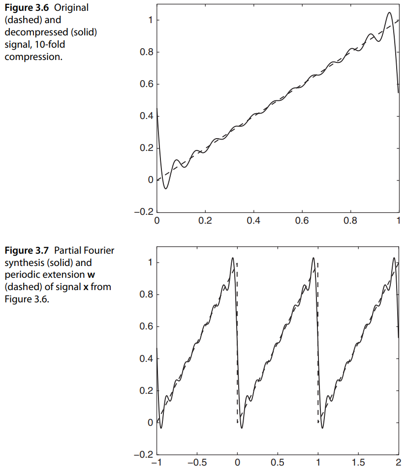
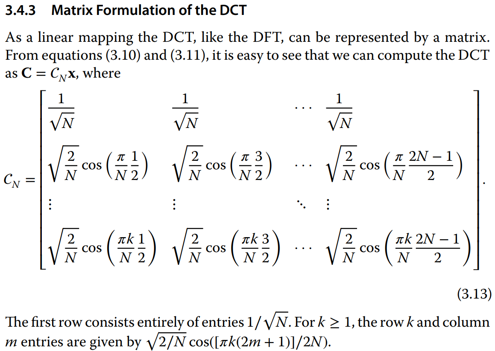
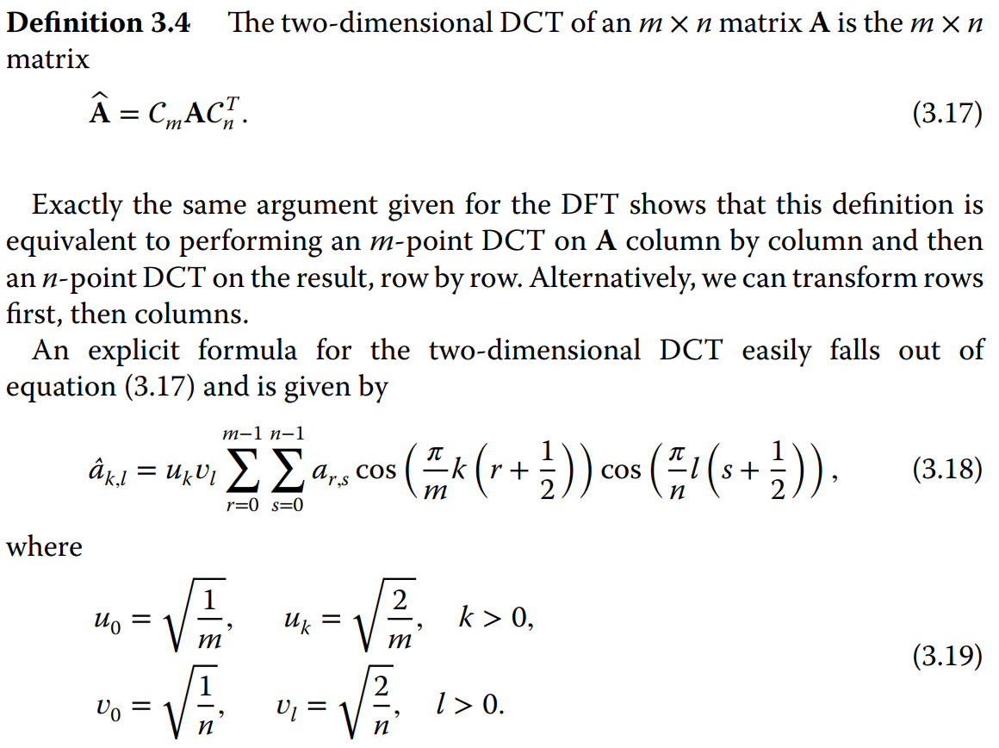

# DCT

- Motivação: compressão de sinais

- Limiarização (threshholding)
  
- Codificação

Medidas de compressão
- Razão de compressão ($P(c)$)
- Distorção ($D(c)$)

obs.: A [[DFT]] não lida bem com pulos. Lembre-se de que a DFT retorna um sinal bi-infinito, então um pulo nas extremidades de um sinal requer a superposição de muitas frequências.
*Ver exemplo da função $f(t) = t, t \in [0,1]$ na seção 3.3.3.*

## Derivação da DCT

Seja
$$c_k = 2 \sum_{m=0}^{N-1} x_m \cos\left(\frac{\pi k (m + 1/2)}{N}\right)$$
tal que os termos da DCT são
$$\~{X}_k = e^{\pi i k / 2N} c_k$$

## Definição de DCT e IDCT

**Definition 3.3** Seja $x \in \mathbb{C}^N$. A DCT (type II) de $x$ é o vetor $C \in \mathbb{C}^N$ com componentes $C_k$ definidas por
$$\begin{align*}
	C_0 &= \sqrt{\frac{1}{N}}\sum\limits_{m=0}^{N-1} x_m\cos\left(\frac{\pi 0\left(m+\frac{1}{2}\right)}{N}\right)
	= \sqrt{\frac{1}{N}}\sum\limits_{m=0}^{N-1} x_m \\
	C_k &= \sqrt{\frac{2}{N}}\sum\limits_{m=0}^{N-1} x_m\cos\left(\frac{\pi k\left(m+\frac{1}{2}\right)}{N}\right), k = 1, 2, \dots, N-1 \\
\end{align*}$$

### Forma matricial da DCT

## DCT bidimensional

