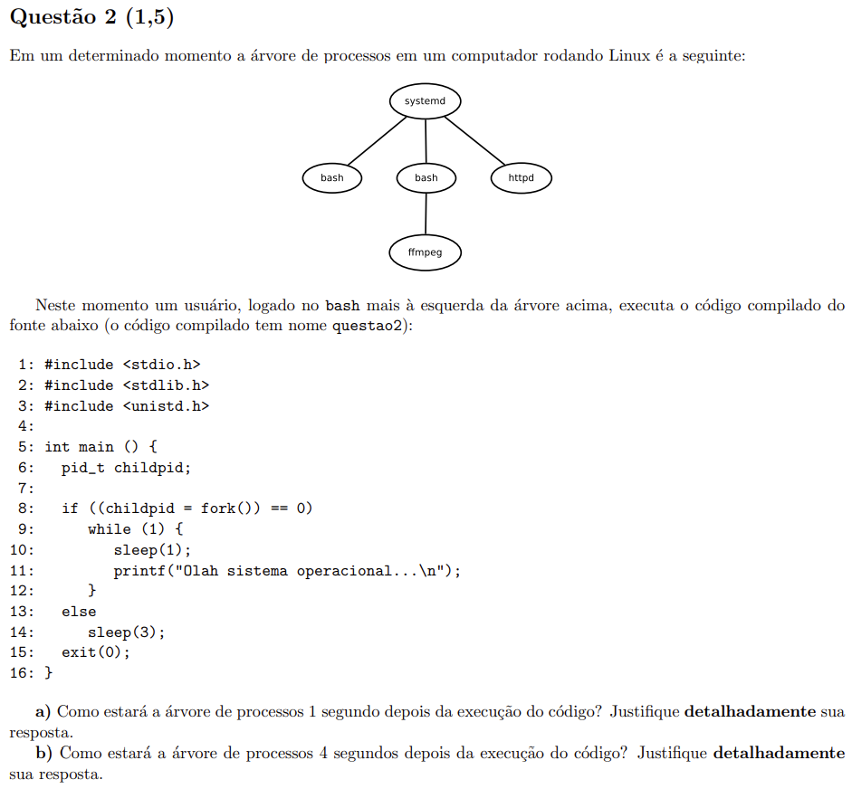
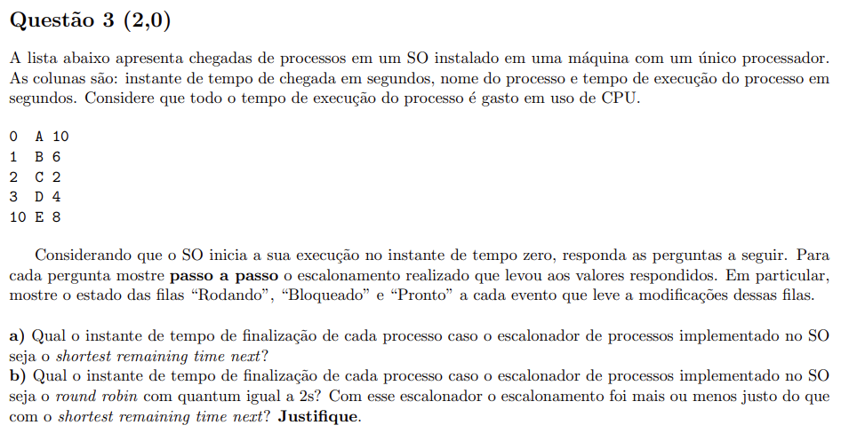

# P1 de [[MAC0422]] (2017)

## Questão 1

Para cada uma das três chamadas de sistema do Linux a seguir, explique, detalhadamente em termos de permissões, hierarquia de processos, tabela de processos e conteúdo de memória, i) o que ela faz e ii) uma condição que deveria fazer a mesma retornar algum erro a ser tratado pelo programador:

### `fork`

Resposta: O processo pai chama `fork` e cria um processo filho, que é cópia de si mesmo.
- Em relação às *permissões*, o processo filho herda as mesmas permissões que o processo pai.
- Em relação à *hierarquia de processos*, o processo que chamou `fork` é pai do processo filho criado.
- Em relação à *tabela de processos*, é atualizada para incluir uma entrada para o novo processo filho.
- Em relação ao *conteúdo da memória*, o processo pai copia o conteúdo da memória ao processo filho, mas cada processo possui área de memória independente.
- Em relação à *condições de erro*, é possível que não haja espaço de memória suficiente para a criação de um novo processo filho.

### `execve`

Resposta: A syscall `execve` substitui o programa que está rodando em um processo por um novo.
- Em relação às *permissões*, `execve` não altera nenhuma permissão, e apenas são consideradas as permissões do programa a ser executado.
- Em relação à *hierarquia de processos*, `execve` não altera a hierarquia.
- Em relação à *tabela de processos*, `execve` não altera a tabela.
- Em relação ao *conteúdo da memória*, `execve` substitui o conteúdo pelo novo programa a ser executado.
- Em relação à *condições de erro*, é possível que o executável não exista ou o executável não possua permissão para ser executado.

### `kill`

Resposta: A syscall `kill` envia um sinal para um ou mais processos, podendo ser tanto para a terminação quanto para o envio de informações.
- Em relação às *permissões*, é necessário que o processo que envia o sinal tenha permissões para alterar os dados do processo que recebe o sinal.
- Em relação à *hierarquia de processos*, `kill` não a afeta.
- Em relação à *tabela de processos*, o processo que recebe o sinal `kill` pode decidir o que fazer de acordo com a tabela de processos.
- Em relação ao *conteúdo de memória*, o processo que recebe o sinal `kill` pode alterar o conteúdo de memória.
- Em relação às *condições de erro*, o processo que envia o sinal pode não ter permissão para alterar propriedades do processo que recebe o sinal.

## Questão 2

Respostas:

a) Após 1 segundo, o nó `bash` mais à esquerda terá criado um nó filho rodando o mesmo processo que o pai, ou seja, `bash`.

b) Após 4 segundos, 

## Questão 3

a) 