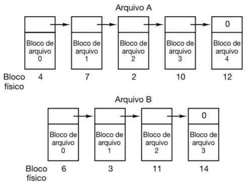

# alocação por lista encadeada

Um arquivo é composto por vários blocos. O início de um bloco aponta para o próximo bloco, e o resto do bloco contém os dados.

## Vantagens

### Utilização completa do disco

Cada bloco do disco pode ser usado, já que não há necessidade de manter uma sequência contígua de blocos para um arquivo.

### Ausência de fragmentação

Não há perda de espaço devido à fragmentação, já que os blocos são alocados conforme necessário e não é necessário encontrar espaços contíguos.

### Armazenamento eficiente no diretório

A entrada para o arquivo no diretório onde ele está armazenado só precisa armazenar o endereço do primeiro bloco, simplificando o gerenciamento de arquivos.

## Desvantagens

### Leitura lenta

A leitura tende a ser lenta, pois para chegar a um determinado bloco, é necessário percorrer todos os $n-1$ blocos anteriores na lista encadeada.

### Perda de espaço do bloco

Parte do espaço de cada bloco é utilizado para armazenar o ponteiro para o próximo bloco na lista encadeada.
Chamadas de sistemas projetadas para ler múltiplos do tamanho de um bloco podem ter um desempenho ruim. Isto pois, ao ler um bloco, pode ser necessário acessar o ponteiro para o próximo bloco na lista encadeada, resultando na leitura de dois blocos em vez de apenas um. Isso aumenta o tempo de acesso e pode impactar negativamente o desempenho da operação de leitura.
