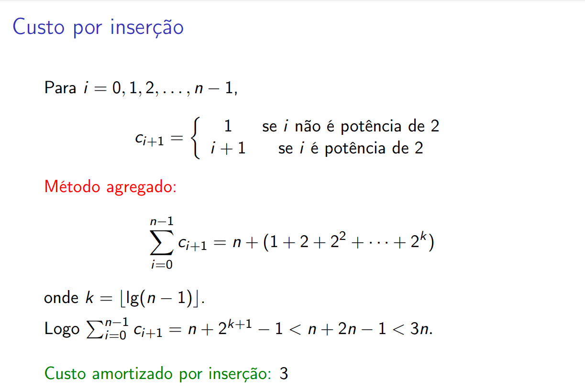

# análise amortizada de inserção em tabelas dinâmicas

## método agregado

- no somatório, o termo $n$ vem da soma de todos os $1$'s dos 2 casos da igualdade de $c_{i+1}$
- o termo em parênteses vem da soma de todas as potências de $2$ do segundo caso da igualdade de $c_{i+1}$

## método por créditos
