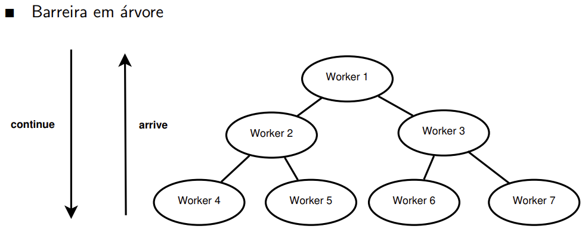

# barreira em árvore

Uma [[barreira de sincronização]] em árvore estrutura os processos em uma árvore binária.



- Para cada tipo de nó (folha, nó interno e raiz), é necessário um algoritmo diferente.

Usando o `continue` em broadcast, temos:
```
folha L:
  if (round == 0) {
    arrive[L] = 1;
    while (continue == 0) skip;
    round = 1;
  } else {
    arrive[L] = 1;
    while (continue == 1) skip;
    round = 0;
  }

no interno I:
  while (arrive[left] == 0) skip;
  arrive[left] = 0;
  while (arrive[right] == 0) skip;
  arrive[right] = 0;
  arrive[I] = 1;
  if (round == 0) {
    while (continue == 0) skip;
    round = 1;
  } else {
    while (continue == 1) skip;
    round = 0;
  }

no raiz R:
  while (arrive[left] == 0) skip;
  arrive[left] = 0;
  while (arrive[right] == 0) skip;
  arrive[right] = 0;
  if (round == 0) {
    round = 1;
    continue = 1;
  } else {
    round = 0;
    continue = 0;
  }
```