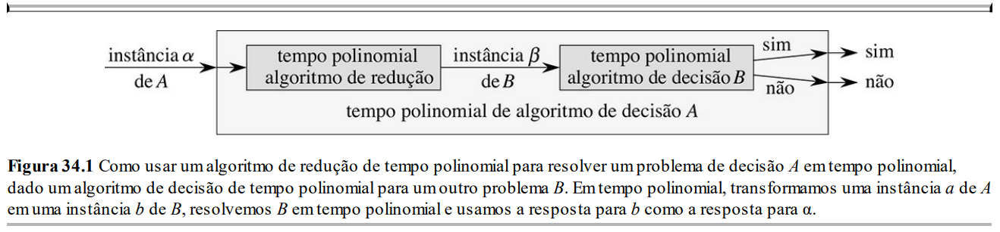

# complexidade computacional

*Capítulo 34 do CLRS*

## Classes de problemas
- classe P
  - *A classe P consiste nos problemas que podem ser resolvidos em tempo polinomial. Mais especificamente, são problemas que podem ser resolvidos no tempo $O(n^k)$ para alguma constante $k$, onde $n$ é o tamanho da entrada para o problema.*
- classe NP
  - *A classe NP consiste nos problemas que são “verificáveis” em tempo polinomial.*
- classe coNP
  - 
- classe NP-completo
  - *Informalmente, um problema está na classe NPC — e nos referiremos a ele como um problema NP-completo — se ele está em NP e é tão “difícil” quanto qualquer problema em NP.*
  - *Enquanto isso, afirmaremos sem provar que, se qualquer problema NP-completo pode ser resolvido em tempo polinomial, então todo problema em NP tem um algoritmo de tempo polinomial.*
- P vs NP

## Problemas de decisão vs problemas de busca vs problemas de otimização
- problema de decisão
  - problema que pede uma resposta binária (sim ou não)
- problema de busca
  - problema que procura um elemento em um conjunto
- problema de otimização
  - problema que procura um elemento de um conjunto de soluções viáveis que seja melhor possível em relação a algum critério
- problemas NP-completos são problemas de decisão
  - entretanto, muitos problemas NP-completos são versões de problemas de busca ou otimização
  - *Normalmente, podemos expressar um determinado problema de otimização como um problema de decisão relacionado impondo um limite para o valor a ser otimizado.*
  - *Por exemplo, um problema de decisão relacionado com SHORTEST-PATH é PATH: dado um grafo dirigido $G$, vértices $u$ e $v$, e um inteiro $k$, existe um caminho de $u$ a $v$ que consiste em no máximo $k$ arestas?*

## Redução
- instância
  - cada conjunto específico de dados de um problema define uma instância
- algoritmo de redução
  - algoritmo que transforma uma instância de um problema em uma instância de outro problema em tempo polinomial
  
- 

- satisfatibilidade booleana