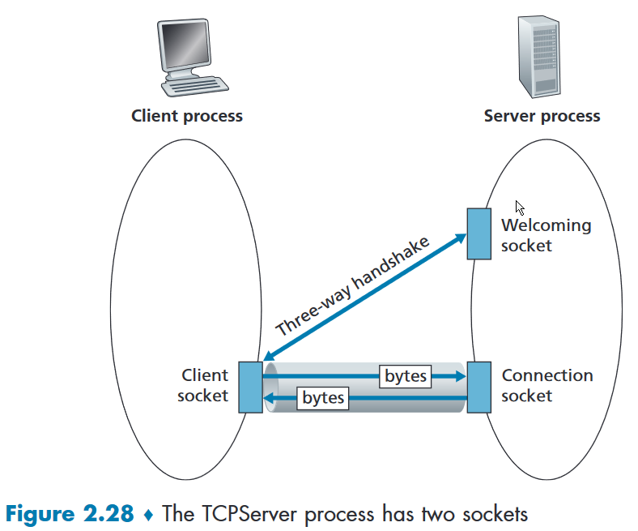

# daytime

- Cliente e servidor

## Passo-a-passo para implementar um cliente

_obs.: os trechos grifados são específicos do daytime_

0. Ler a RFC (IETF)
- Existe uma porta bem-definida?
  - **Porta 13**
- Qual é a sequência de reads e writes?
- Quem fecha a conexão?
1. Definir quantos sockets são necessários
2. Definir quantas áreas de memória serão necessárias para armazenar informações enviadas e recebidas
- **`char recvline[MAXLINE+1]`**
3. Declarar a estrutura de endereçamento para cada socket
- **`struct sockaddr_in servaddr`**
4. Criar cada socket e associar aos descritores do passo 1
- Definir qual é o protocolo de de transporte
  - **TCP**
5. Preparar a estrutura de endereçameno de cada socket criado no passo 4
- Tomar cuidado com a representação interna dos bytes na máquina
6. Fazer a conexão
 
- [[three-way-handshake]]
7. Implementar o protocolo de camada de aplicação
- **No caso do daytime, vai ser um laço com read**


## Passo-a-passo para implementar um servidor

0. Ler a RFC
1. Definir quantos sockets serão necessários
2. Definir quantas áreas de memória serão necessárias para armazenar informações enviadas e recebidas
3. Declarar a estrutura de endereçamento para cada socket
4. Criar o socket
5. Preparar a estrutura de endereço
6. Informar que o socket vai escutar em uma porta específica
7. Informar que vai escutar por conexão
8. Aceitar as conexões dos clientes
9. Implementar o protocolo da camada de aplicação

```C
/* Código simples de um servidor daytime. Não é o código ideal (deveria ter
 * returns ou exits após os erros das funções por exemplo) mas é suficiente
 * para começar a entender como se escreve servidores TCP usando sockets.
 * 
 * RFC do daytime: http://www.faqs.org/rfcs/rfc867.html
 *
 * Prof. Daniel Batista em 26/04/2021. Baseado no código disponibilizado no livro do Stevens
 *
 * Bugs? Tente consertar primeiro! Depois me envie email :) batista@ime.usp.br
 */
#include <time.h>
#include <sys/socket.h>
#include <strings.h>
#include <string.h>
#include <arpa/inet.h>
#include <stdio.h>
#include <unistd.h>
#define MAXLINE 100
#define LISTENQ 1
int main(int argc, char **argv) {
  int listenfd, connfd;
  char buff[MAXLINE]; // passo 2
  struct sockaddr_in servaddr; // passo 3
  time_t ticks;
  
  listenfd = socket(AF_INET, SOCK_STREAM, 0); // passo 4 (?)
  if (listenfd < 0)
    fprintf(stderr,"socket error :(\n");
  
  // passo 5
  bzero(&servaddr, sizeof(servaddr));
  servaddr.sin_family = AF_INET;
  servaddr.sin_addr.s_addr = htonl(INADDR_ANY);
  servaddr.sin_port = htons(13); // passo 6
  
  if (bind(listenfd, (struct sockaddr *) &servaddr, sizeof(servaddr)) < 0 )
    fprintf(stderr,"bind error :(\n");
  if (listen(listenfd, LISTENQ) < 0)
    fprintf(stderr,"listen error :(\n");
  
  for ( ; ; ) {
    connfd = accept(listenfd, (struct sockaddr *) NULL, NULL);
    if (connfd < 0)
      fprintf(stderr,"accept error :(\n");
    
    ticks = time(NULL);
    snprintf(buff, sizeof(buff), "%.24s\r\n", ctime(&ticks));
    if (write(connfd, buff, strlen(buff)) < 0)
      fprintf(stderr,"write error :(\n");
    
    close(connfd);
  }
  return(0);
}
```