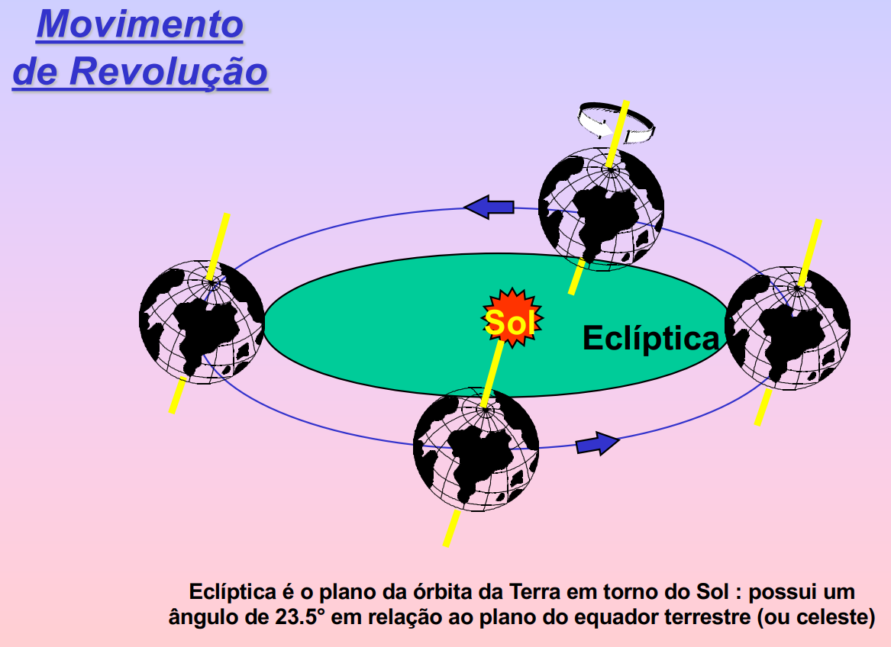

# eclíptica

A **eclíptica** é o caminho anual do Sol sobre a esfera celeste (plano da órbita da Terra).

A **eclíptica** é o caminho aparente que o Sol percorre no céu ao longo de um ano, visto da Terra. Esse caminho é uma projeção da órbita da Terra ao redor do Sol na esfera celeste. Devido à inclinação do eixo da Terra em relação ao plano de sua órbita, a eclíptica não coincide com o equador celeste, mas está inclinada em um ângulo de aproximadamente 23,5 graus.

A eclíptica é uma linha imaginária que parece traçada pelo Sol no céu durante o ano, à medida que a Terra orbita ao seu redor. Ela passa pelos doze signos do zodíaco, que são as doze constelações pelas quais o Sol aparentemente passa durante o ano, devido ao movimento da Terra.

A eclíptica é uma referência importante na astronomia, especialmente na astrologia, onde os doze signos do zodíaco são utilizados como base para a interpretação dos eventos e características pessoais das pessoas de acordo com a posição do Sol durante seu nascimento. Além disso, muitos outros corpos celestes, como a Lua e os planetas, também estão próximos da eclíptica em seus movimentos aparentes no céu.

