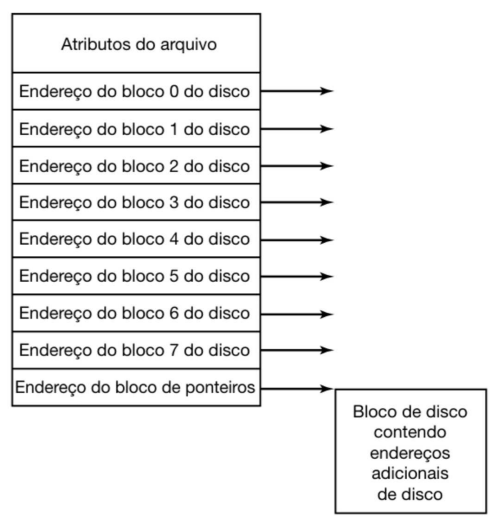

# i-node

- Cada arquivo é associado a uma estrutura de dados chamada [[i-node]].
- Um i-node lista os atributos e endereços de disco dos blocos do arquivo.
- Dado um i-node, é possível encontrar todos os blocos de um arquivo.

## Vantagens

### Economia de uso de memória

Ao contrário do [[FAT]], o i-node precisa ser carregado na memória apenas quando o arquivo associado a ele estiver aberto.

O espaço em memória usando i-nodes é proporcional à quantidade máximoa de arquivos abertos. Já o espaço em memória usando FAT é proporcional ao tamanho do disco.

## Desvantagens

### Tamanho fixo do i-node

Para facilitar o acesso, o tamanho do i-node precisa ser fixo. No entanto, isso limita o tamanho máximo de um arquivo, pois quanto mais blocos um arquivo tiver, mais endereços de bloco precisarão ser armazenados no i-node.

> Obs.: Pode-se resolver essa limitação usando o último endereço de bloco para apontar para um endereço no disco que contenha mais endereços de bloco. Isso permite que um arquivo ultrapasse o limite de tamanho imposto pelo tamanho fixo do i-node.
