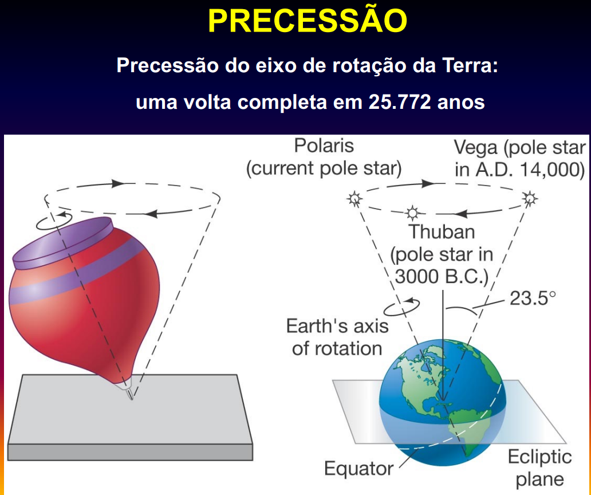

# precessão

- O eixo de rotação varre um cone no espaço de ângulo de vértice igual a 23.5 graus e com período de 25772 anos.
- A causa física da precessão é a ação de um torque provocado pelas forças gravitacionais essencialmente do Sol e da Lua agindo sobre a Terra.
- A precessão desloca o [[ponto vernal]] no sentido oposto ao movimento do Sol na [[eclíptica]].