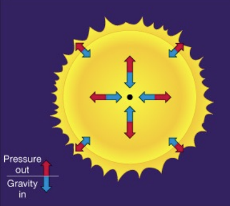

# sequência principal (SP)

Características básicas da sequência principal:

- Fusão de hidrogênio em hélio.
- Estrela em equilíbrio hidrostático
  - A gravidade é contrabalanceada pela pressão do gás aquecido pela queima do hidrogênio.
  - 